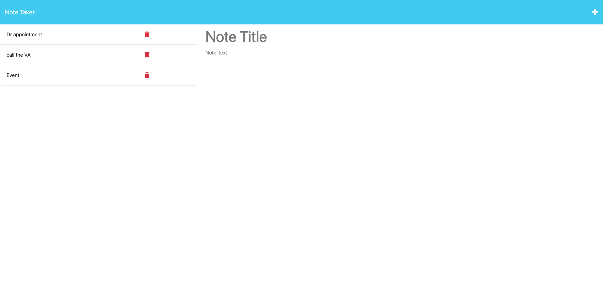

# 10 Weekly Project - Note-Taker

## Description

Real-time note taking application. Take notes, update them, and delete them with this note-taker application.

## Table of Contents

1. [The Task](#the-task)
2. [Install](#install)
3. [Languages Used](#languages-used)
4. [Screenshots](#screenshots)
5. [Links](#links)
6. [acknowledgements](#acknowledgements)
7. [credit](#credit)

## The Task

### User Story

- AS A small business owner  
- I WANT to be able to write and save notes 
- SO THAT I can organize my thoughts and keep track of tasks I need to complete

### Acceptance Criteria

- GIVEN a note-taking application
   
- WHEN I open the Note Taker
   
- THEN I am presented with a landing page with a link to a notes page
   

- WHEN I click on the link to the notes page
   
- THEN I am presented with a page with existing notes listed in the left-hand column, plus empty fields to enter a new note title and the note’s text in the right-hand column
   
- WHEN I enter a new note title and the note’s text
   
- THEN a Save icon appears in the navigation at the top of the page 

- WHEN I click on the Save icon 

- THEN the new note I have entered is saved and appears in the left-hand column with the other existing notes 

- WHEN I click on an existing note in the list in the left-hand column 

- THEN that note appears in the right-hand column 

- WHEN I click on the Write icon in the navigation at the top of the page 

- THEN I am presented with empty fields to enter a new note title and the note’s text in the right-hand column

## Install

Steps to run application:

1. Clone git repository
2. Install dependencies
3. Start the application with an empty db.json file
4. run app

## Languages Used

 

    
    
    
    
    
    

## Screenshots:

## links

- [Github Repo](https://github.com/mdRashed30/06-Weekly-challenge-Weather-dashboard)

- [Deployed Page](https://mdrashed30.github.io/06-Weekly-challenge-Weather-dashboard/)

## acknowledgements :

-- Video tutorial

-- TA

## Credit:

Special thanks to my friends who help me -

-- Indrojit Ghosh
 
